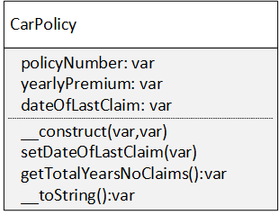

# Week 7 Lab

Clone this repo into your www folder under laragon. In the command prompt, cd into the \laragon\www folder. Make sure that you are in the correct folder and that laragon\www appears in the command prompt. Type git clone your-repo-url (Get your repo url from github after creating the repo). Then cd into the folder you have just cloned by typing cd week7Lab-yourgithubid. Once you are in the correct folder, keep this command window open so you can type in your git commands as required.

The following assignment has two objectives
- To ensure you can follow a UML specification precisely to create the class that is described
- To ensure you can implement the \_\_toString() magic method.
  
\_\_toString() is one of a number of magic methods - sometimes called "dunder" methods which can be overridden in order to make the resultant object behave in a particular way when used in a particular context.
in the case of the \_\_toString_( ) function we control how the object behaves when used like a string - e.g. printed or concatenated.

# Part 1
Create the classes as described in the UML diagram for the CarPolicy Object



Follow the names of the classes, attributes and methods exactly as in the diagram

In the policy class the \_\_toString() function should return the policy number followed by a colon, then a space, followed by the name of the policy holder. So policy number 1234 held by John Smith should retrun "1234: John Smith"

The getTotalYearsNoClaims() function is as follows
```
public function getTotalYearsNoClaims()
{
     $currentDate = new DateTime();
     $lastDate= new DateTime($this->dateOfLastClaim);
     $interval = $currentDate->diff($lastDate);
     return $interval->format("%y");
}
```
When your CarPolicy class is complete, type php testCarPolicy.php to test your class.

# Part 2
